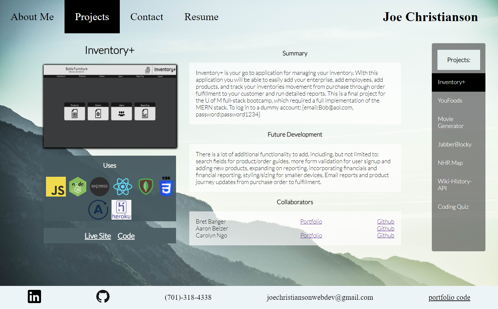

# Portfolio

## Introduction

This front end app was developed at the end of a full-stack bootcamp to showcase my individual and group projects and provide information to potential employers or collaborators. This app was also an optional project assigned by the bootcamp to practice React. 

## Contents

### About Me

This includes a profile made in Inkscape.

### Projects

Projects are objects which are used to dynamically generate all the content on the page. Links are included for the live site, code, and profiles of collaborators.

### Contact

Contact form uses a third party service, "Get Form." See documentation here: https://docs.getform.io/.

### Resume

## Technologies

- React
- CSS
- HTML

## Launch Locally

- Clone Repo
- "npm i"
- "npm start"

## Live Link

https://joechristianson.github.io/ReactPortfolio/

## License

MIT